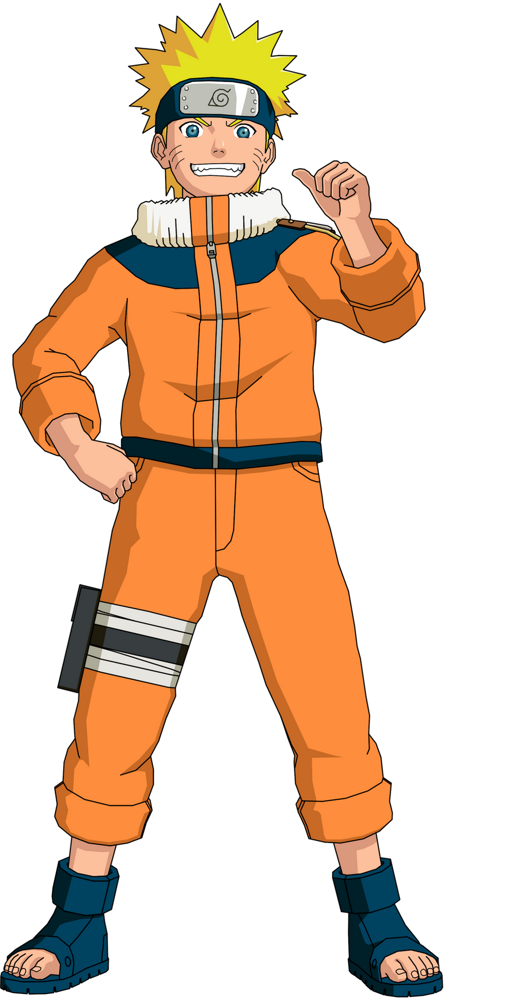
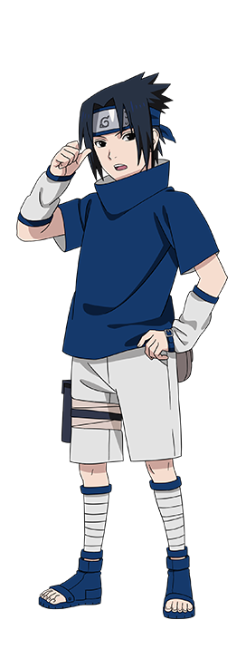
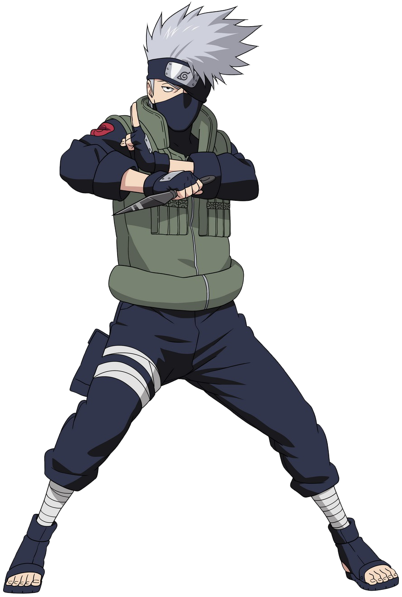
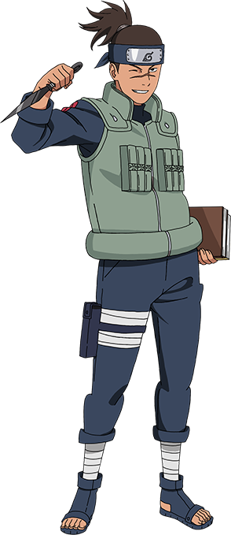
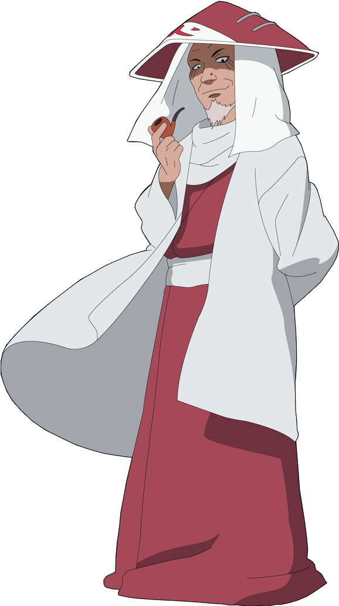
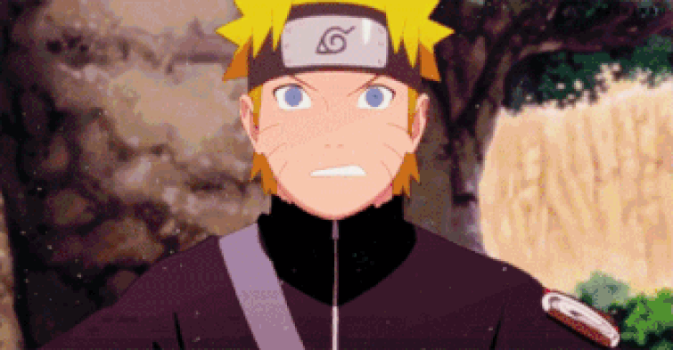
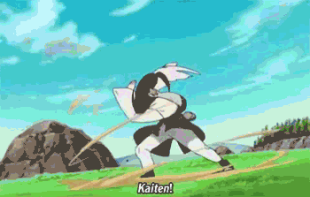
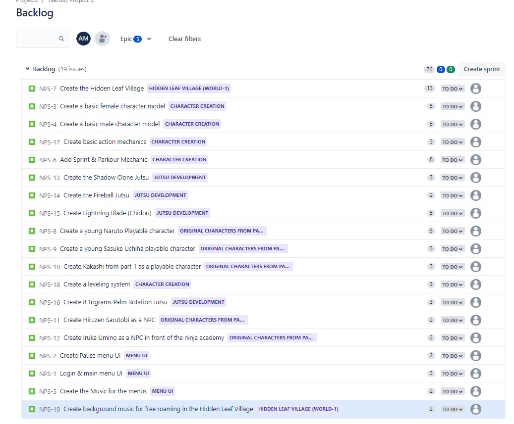
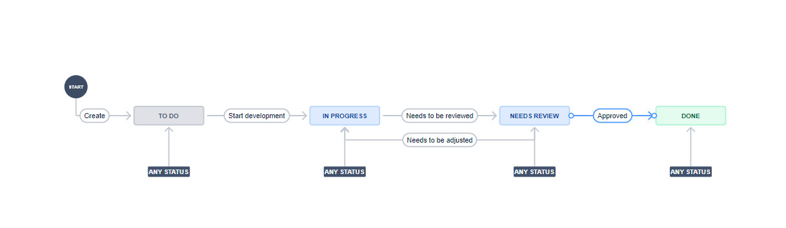

# Name: Naruto: Project S
# By: Abdel-Rahman Ibrahim El Said Ahmed Megahed  ID: 18P7423
This is a MMO RPG game where the players can create their own character or play as the ones from the series in an online adventure where they choose if they want to be a good ninja or a rogue one.

### Team Members
#### Team 1
| Name | Role | Expertise |
| ----------- | ----------- | ----------- |
| Abdel-Rahman Megahed | Designer | Main Story Design |
| Menna | Artist | Background Layout |
| Ahmed Dessouky | Sound Engineer | Voice Editing |
| Akmal | Programmer | UI & Physics |

#### Team 2
| Name | Role | Expertise |
| ----------- | ----------- | ----------- |
| Youssef | Designer | MMO Design |
| Seif | Programmer | Network Communications & AI |
| Mohamed | Programmer | Input Processing & Gameplay |
| Nadine | Artist | Character Models & Outfits |

#### Team 3
| Name | Role | Expertise |
| ----------- | ----------- | ----------- |
| Mostafa | Designer | RPG Design | 
| Mariam | Programmer | Physics & Graphics |
| Mahmoud | Sound Engineer | Audio Merging |
| Hannah | Sound Engineer | Game Soundtracks |

### Stakeholders
| Name | Influence | Availability | Engagement |
| ----------- | ----------- | ----------- | ----------- |
| Bandai Namco | Very High | High | Keep Satisfied |
| Masashi Kishimoto | Very High | Low | Actively Engaged |
| CyberConnect | Low | Low | Monitor |
| Ukyō Kodachi | High | High | Keep Informed |

## Near Vision
### Sprint 1
1. Create log in menu and pause menu UI
2. Create a basic empty model of the Hidden Leaf Village
3. Create a basic female and male character player model
4. Create basic action mechanics (Dodge, punch, kick, jump)
5. Create Music for the menus
6. Create Background music for free roam
### Sprint 2
1. Create the first set of Characters (Playable and not playable) as stated below
2. Create Sprint & Parkour Mechanics
3. Create the first set of basic jutsu as stated below
4. Create leveling system

### First Set Of Characters
| Name | Image | Playable?|
| ----------- | ----------- | ----------- |
| Naruto Uzumaki (Part 1) |  | ✓ |
| Sasuke Uchiha (Part 1) |  | ✓ |
| Kakashi Hatake |  | ✓ |
| Iruka Umino |  | ✗ |
| Hiruzen Sarutobi (Hokage Outfit) |  | ✗ |

#### First Set of Jutsu
| Name | Description | Image |
| ----------- | ----------- | ----------- |
| Shadow Clone Jutsu | The user can summon multiple copies of themselves to fight |  | 
| Fireball Jutsu | The user breathes out a ball made out of fire in the indicated direction |  |
| Lightning Blade (Chidori) | The user creates a ball of lightning in their palms and runs towards a target to deal a damaging blow  |  |
| Eight Trigrams Palm Rotation | The user rotates creating a sphere around them that sheilds the user from objects and deals damage to people that touch it |  |

## Far Vision
1. Create a fully functional MMO RPG based on the Naruto Universe
2. Implement all jutsus that appeared in the show
3. Create a character creator based on the Naruto artwork
4. Introduce PVP
5. Create Time-Based events

## PBI Order Rationale
I ordered the PBIs by checking to see the dependencies of each PBI to make sure all the items needed to develop a PBI are present.
I also took into account that there are some PBIs that need to be built right away like the basic character models, actions, and sprinting & parkour because these are basic things that are going to be used by every playable character. Miscellaneous things like the music and login and pause UI were left at the end.
## Ordered Product Backlog

## Worflow
After a story is created and placed in its correct order, we need to start working on it (in progress). If the development team believe that the story is done, the story moves from in progess to needs review. Then, the Product Owner reviews the feature, if he approves it then the development of the feature has concluded, if he rejects the feature then the development team will begin to adjust the feature for the Product Owner to approve it.

## 2 Daily Scrum Documents
1. 
| Name | Questions to be answered | Sunday | Monday | Tuesday | Wednesday | Thursday |
| ----------- | ----------- | ----------- | ----------- | ----------- | ----------- | ----------- |
| Abdel-Rahman | What did I do yesterday? | Worked on the main villian backstory | Finished the character of the main villian |  |  |  |
|  | what will I work on today? | I will finalize the character of the main villian | Design the story board for the main storyline |  |  |  |
|  | Did I encounter any obstacles? | No | No |  |  |  |
| Menna |  What did I do yesterday? | Created a 3D model of the outside hokage mansion in the Hidden leaf village | Modeled the hokage's office |  |  |  |
|  | what will I work on today? | Model the hokage's office | Create a 3D model of the main street of the village |  |  |  |
|  | Did I encounter any obstacles? | The computer was slow at rendering the environment | No |  |  |  |
2.
| Name | Questions to be answered | Sunday | Monday | Tuesday | Wednesday | Thursday |
| ----------- | ----------- | ----------- | ----------- | ----------- | ----------- | ----------- |
| Abdel-Rahman | What did I do yesterday? | Designed the basic leveling system | Assigned levels to developed jutsus and future ones |  |  |  |
|  | what will I work on today? | Assign levels to developed jutsus and future ones | Work on the character perks |  |  |  |
|  | Did I encounter any obstacles? | Was not sure what levels to assign some jutsus | No |  |  |  |
| Menna |  What did I do yesterday? | Worked on Naruto's body | Worked on Naruto's hair & physics |  |  |  |
|  | what will I work on today? | Work on Naruto's hair & physics | Create the animation for the Shadow clone jutsu |  |  |  |
|  | Did I encounter any obstacles? | Not enough references | Animations were choppy so I tried to increase the framerate |  |  |  |

## Sprint Document
### First:
Goal: Acheive a beta version of the Hidden Leaf village and be able to traverse the village freely by using the developed character models that can do the basic actions like jumping and punching. Also, complete the login screeen and main menu UI with background music.  
Progress: Completed successfully  
Next Sprint: Get the first 2 NPCs, 3 playable characters and some jutsu, and the sprinting and parkour mechanics to be implemented  
### Second:
Goal: Get the first 2 NPCs, 3 playable characters and some jutsu, and the sprinting and parkour mechanics to be implemented. Also, add music when exploring the Hidden Leaf Village  
Progress: Completed successfully  
Next Sprint: Add more characters, more jutsu, and begin building the character creator
