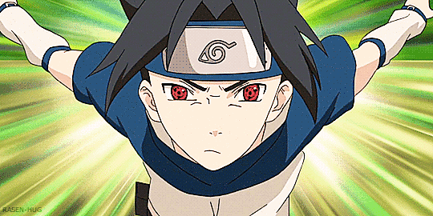

# Name: Naruto: Project S
# By: Abdel-Rahman Ibrahim El Said Ahmed Megahed  ID: 18P7423

### Team Members
#### Team 1
| Name | Role | Expertise |
| ----------- | ----------- | ----------- |
| Abdel-Rahman Megahed | Designer | Main Story Design |
| Menna | Artist | Background Layout |
| Ahmed Dessouky | Sound Engineer | Voice Editing |
| Akmal | Programmer | UI & Physics |

#### Team 2
| Name | Role | Expertise |
| ----------- | ----------- | ----------- |
| Youssef | Designer | MMO Design |
| Seif | Programmer | Network Communications & AI |
| Mohamed | Programmer | Input Processing & Gameplay |
| Nadine | Artist | Character Models & Outfits |

#### Team 3
| Name | Role | Expertise |
| ----------- | ----------- | ----------- |
| Mostafa | Designer | RPG Design | 
| Mariam | Artist | Story and Game Design |
| Mahmoud | Sound Engineer | Audio Merging |
| Hannah | Sound Engineer | Game Soundtracks |

### Stakeholders
| Name | Influence | Availability | Engagement |
| ----------- | ----------- | ----------- | ----------- |
| Bandai Namco | Very High | High | Keep Satisfied |
| Masashi Kishimoto | Very High | Low | Actively Engaged |
| CyberConnect | Low | Low | Monitor |
| Ukyō Kodachi | High | High | Keep Informed |

## Near Vision
### Sprint 1
1. Create log in menu and pause menu UI
2. Create a basic empty model of the Hidden Leaf Village
3. Create a basic female and male character player model
4. Create Sprint mechanic
### Sprint 2
1. Create the first set of Characters (Playable and not playable) as stated below
2. Create basic action mechanics (Dodge, punch, kick, jump)
3. Create the first set of basic jutsu as stated below
4. Create basic side missions (Delivery quests, and Gather quests)

### First Set Of Characters
| Name | Image | Playable?|
| ----------- | ----------- | ----------- |
| Naruto Uzumaki (Part 1) |  | ✓ |
| Sasuke Uchiha (Part 1) |  | ✓ |
| Kakashi Hatake |  | ✓ |
| Iruka Umino |  | ✗ |
| Hiruzen Sarutobi (Hokage Outfit) |  | ✓ |

#### First Set of Jutsu
| Name | Description | Image |
| ----------- | ----------- | ----------- |
| Shadow Clone Jutsu | The user can summon multiple copies of themselves to fight |  | 
| Fireball Jutsu | The user breathes out a ball made out of fire in the indicated direction |  |
| Lightning Blade (Chidori) | The user creates a ball of lightning in their palms and runs towards a target to deal a damaging blow  |  |
| Eight Trigrams Palm Rotation | The user rotates creating a sphere around them that sheilds the user from objects and deals damage to people that touch it |  |
